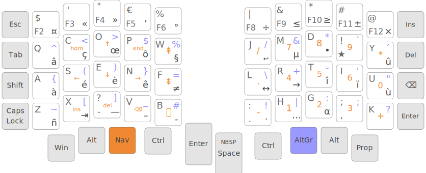

# Kalamine Fork for ErgolR

> ☝️ **Disclaimer** \
> This fork is used to work on ErgolR—🚧 work in progress.

## ErgolR

Keyboard layout variant of [Ergo-L](https://ergol.org/).



🔗 **Layouts:**

- [Ergo-L](https://github.com/Nuclear-Squid/ergol/blob/main/keymaps/fr/ergol.toml)
- [ErgolR](layouts/ergolr.toml)

### Differences

- Designed for [Sofle](https://josefadamcik.github.io/SofleKeyboard/): 4x6 split keyboard
- Locale is English instead of French, because my Windows is in English and I prefer picking emojis by their English name (e.g. 🎉 "tada" is named "Cotillon" in French), which is the case in lots of apps: Chat, Confluence, GitBook...

#### Num row

- Gives direct access to the main <kbd>F*</kbd> keys used with Visual Studio keymap: `F2..F6` on the left, `F8..F12` on the right.
- `F1` (help) is skipped because I rarely use it and it's so borrowing when accidentally pressed.
- `F7` is skipped too as I never used it for any shortcut.
- <kbd>Shift</kbd> characters revisited:
  - `€` and `$` inverted to favor `€`
  - `«` and `»` moved to the _Symbols_ layer, to favor `'` and `"`
  - `&` and `|` put next to each other, for `AND`/`OR` binary/boolean operators

#### Accent layer

_(Layer accessible with the dead key `★`)_

Less accentuated characters (`æ` and `ß` removed, `ñ` moved from <kbd>F</kbd> to <kbd>Z</kbd>), more special characters, to match the one I used frequently, especially when writing code and documentation—e.g.:

- `↩`: to force the code formatter to put a line break
- Arrows: `↔`, `→`
- Dots: `•` _(bullet point)_, `·` _(middle dot)_

#### Symbols layer

- Still accessible when holding <kbd>AltGr</kbd>
- More symbols, placed in the _Num row_

#### NavNum layer

- Navigation keys:
  - 3rd row: no multimedia keys, but `ins`, `del`, `backspace`, and especially `print screen`.
- Num pad:
  - purpose: usable to do small computations with the `calc` Windows app.
  - `*` on the 1st row, as `/`
  - `+` on the 3rd row, as `-`
  - `.` on the 2nd row, as `0`

---

## Kalamine

A text-based, cross-platform Keyboard Layout Maker.

🔗 [GitHub](https://github.com/OneDeadKey/kalamine)

## Install

To install kalamine, all you need is a Python 3.8+ environment and `pip`:

```bash
# to install kalamine
python3 -m pip install --user kalamine

# to upgrade kalamine
python3 -m pip install --user --upgrade kalamine

# to uninstall kalamine
python3 -m pip uninstall --user kalamine
```

However, we recommend using [pipx](https://pipx.pypa.io) rather than `pip` as it provides `pyenv`
containment, which is a much saner approach and is becoming mandatory on many
operating systems (e.g. Arch Linux). It is even simpler from a user perspective:

```bash
# to install kalamine
pipx install kalamine

# to upgrade kalamine
pipx upgrade kalamine

# to uninstall kalamine
pipx uninstall kalamine
```

Arch Linux users may use the [AUR package](https://aur.archlinux.org/packages/kalamine-git):

```bash
yay -S kalamine-git
```

Developer-specific installation instructions can be found in the [CONTRIBUTING.md](CONTRIBUTING.md) file.

## Building Distributable Layouts

Create a keyboard layout with `kalamine new`:

```bash
kalamine new layout.toml                  # basic layout
kalamine new layout.toml --altgr          # layout with an AltGr layer
kalamine new layout.toml --1dk            # layout with a custom dead key
kalamine new layout.toml --geometry ERGO  # apply an ortholinear geometry
```

Edit this layout with your preferred text editor:

- the [user guide](https://github.com/OneDeadKey/kalamine/tree/master/docs) is available at the end of the `*.toml` file
- the layout can be rendered and emulated with `kalamine watch` (see next section)

Build your layout:

```bash
kalamine build layout.toml
```

Get all distributable keyboard drivers:

```bash
dist/
  ├─ layout.ahk            # Windows (user)
  ├─ layout.klc            # Windows (admin)
  ├─ layout.keylayout      # macOS
  ├─ layout.xkb_keymap     # Linux (user)
  ├─ layout.xkb_symbols    # Linux (root)
  ├─ layout.json           # web
  └─ layout.svg
```

You can also ask for a single target by specifying the file extension:

```bash
kalamine build layout.toml --out layout.xkb_symbols
```

## Emulating Layouts

Your layout can be emulated in a browser — including dead keys and an AltGr layer, if any.

```bash
$ kalamine watch layout.toml
Server started: http://localhost:1664
```

Check your browser, type in the input area, test your layout. Changes on your TOML file are auto-detected and reloaded automatically.


Press Ctrl-C when you’re done, and kalamine will write all platform-specific files.

## Using Distributable Layouts

### Windows (user): `*.ahk`

* download the [AHK 1.1 archive](https://www.autohotkey.com/download/ahk.zip)
* load the `*.ahk` script with it.

The keyboard layout appears in the notification area. It can be enabled/disabled by pressing both Alt keys.

You may also use Ahk2Exe to turn your `*.ahk` script into an executable file. The `U32 Unicode 32-bit.bin` setting seems to work fine.

### Windows (admin): `*.klc`

Note: this applies only if you want to use the `*.klc` file.
A better approach is to use `wkalamine` (see below).

* get a keyboard layout installer: [MSKLC](https://www.microsoft.com/en-us/download/details.aspx?id=102134) (freeware) or [KbdEdit](http://www.kbdedit.com/) (shareware);
* load the `*.klc` file with it;
* run this installer to generate a setup program;
* run the setup program;
* **restart your session**, even if Windows doesn’t ask you to.

The keyboard layout appears in the language bar.

Note: in some cases, custom dead keys may not be supported any more by MSKLC on Windows 10/11.
KbdEdit works fine, but its installers are not signed.
WKalamine works fine as well (see below) and its installers are signed.

Basic developer info available in Kalamine’s [KLC documentation page](https://github.com/OneDeadKey/kalamine/tree/master/docs/klc.md).

### macOS: `*.keylayout`

* copy your `*.keylayout` file into:
  * either `~/Library/Keyboard Layouts` for the current user only,
  * or `/Library/Keyboard Layouts` for all users;
* restart your session.

The keyboard layout appears in the “Language and Text” preferences, “Input Methods” tab.

### Linux (root): `*.xkb_symbols`

**This is by far the simplest method to install a custom keyboard layout on Linux.**

Recent versions of XKB allow *one* custom keyboard layout in root space:

```bash
sudo cp layout.xkb_symbols ${XKB_CONFIG_ROOT:-/usr/share/X11/xkb}/symbols/custom
```

Your keyboard layout will be listed as “Custom” in the keyboard settings.
This works on both Wayland and X.Org. Depending on your system, you might have to relog to your session or to reboot X completely.

On X.Org you can also select your keyboard layout from the command line:

```bash
setxkbmap custom  # select your keyboard layout
setxkbmap us      # get back to QWERTY
```

On Wayland, this depends on your compositor. For Sway, tweak your keyboard input section like this:

```properties
input type:keyboard {
    xkb_layout "custom"
}
```

### Linux (user): `*.xkb_keymap`

`*.xkb_keymap` keyboard descriptions can be applied in user-space. The main limitation is that the keyboard layout won’t show up in the keyboard settings.

On X.Org it is straight-forward with `xkbcomp`:

```bash
xkbcomp -w10 layout.xkb_keymap $DISPLAY
```

Again, `setxkbmap` can be used to get back to the standard us-qwerty layout on X.Org:

```bash
setxkbmap us
```

On Wayland, this depends on your compositor. For Sway, tweak your keyboard input section like this:

```properties
input type:keyboard {
    xkb_file /path/to/layout.xkb_keymap
}
```

## WKalamine

`wkalamine` is a Windows-specific CLI tool to create [MSKLC](https://www.microsoft.com/en-us/download/details.aspx?id=102134) setup packages.

This is kind of a hack, but it provides an automatic way to build setup packages on Windows and more importantly, these setup packages overcome MSKLC’s limitations regarding chained dead keys and AltGr+Space combos.

It is done by generating the C layout file, and tricking MSKLC to use it by setting it as read-only before.

Make sure MSKLC is installed and build your installer:

```bash
wkalamine build layout.toml
```

and you should get a `[layout]\setup.exe` executable to install the layout.

Remember to log out and log back in to apply the changes.

## XKalamine

`xkalamine` is a Linux-specific CLI tool for installing and managing keyboard layouts with XKB, so that they can be listed in the system’s keyboard preferences.

### Wayland (user)

On *most* Wayland environments, keyboard layouts can be installed in user-space:

```bash
# Install a YAML/TOML keyboard layout into ~/.config/xkb
xkalamine install layout.toml

# Uninstall Kalamine layouts from ~/.config/xkb
xkalamine remove us/prog     # remove the kalamine 'prog' layout
xkalamine remove fr          # remove all kalamine layouts for French
xkalamine remove "*"         # remove all kalamine layouts

# List available keyboard layouts
xkalamine list               # list all kalamine layouts
xkalamine list fr            # list all kalamine layouts for French
xkalamine list us --all      # list all layouts for US English
xkalamine list --all         # list all layouts, ordered by locale
```

Once installed, layouts are selectable in the desktop environment’s keyboard preferences. On Sway, you can also select a layout like this:

```properties
input type:keyboard {
    xkb_layout "us"
    xkb_variant "prog"
}
```

Note: some desktops like KDE Plasma, despite using Wayland, do not support
keyboards layouts in `~/.config:xkb` out of the box. In such cases, using
`xkalamine` as `sudo` is required, as described below.

### X.Org (root)

On X.Org, a layout can be applied on the fly in user-space:

```bash
# Equivalent to `xkbcomp -w10 layout.xkb_keymap $DISPLAY`
xkalamine apply layout.toml
```

However, installing a layout so it can be selected in the keyboard preferences requires `sudo` privileges:

```bash
# Install a YAML/TOML keyboard layout into /usr/share/X11/xkb
sudo env "PATH=$PATH" xkalamine install layout.toml

# Uninstall Kalamine layouts from /usr/share/X11/xkb
sudo env "PATH=$PATH" xkalamine remove us/prog
sudo env "PATH=$PATH" xkalamine remove fr
sudo env "PATH=$PATH" xkalamine remove "*"
```

Once installed, you can apply a keyboard layout like this:

```bash
setxkbmap us -variant prog
```

Note that updating XKB will delete all layouts installed using `sudo xkalamine install`.

Sadly, it seems there’s no way to install keyboard layouts in `~/.config/xkb` for X.Org. The system keyboard preferences will probably list user-space kayouts, but they won’t be usable on X.Org.

> If you want custom keymaps on your machine, switch to Wayland (and/or fix any remaining issues preventing you from doing so) instead of hoping this will ever work on X.
>
> -- [Peter Hutterer](https://who-t.blogspot.com/2020/09/no-user-specific-xkb-configuration-in-x.html)

### Resources

XKB is a tricky piece of software. The following resources might be helpful if you want to dig in:

* https://www.charvolant.org/doug/xkb/html/
* https://wiki.archlinux.org/title/X_keyboard_extension
* https://wiki.archlinux.org/title/Xorg/Keyboard_configuration
* https://github.com/xkbcommon/libxkbcommon/blob/master/doc/keymap-format-text-v1.md

## Alternative

* https://github.com/39aldo39/klfc

## Development

### Watch
